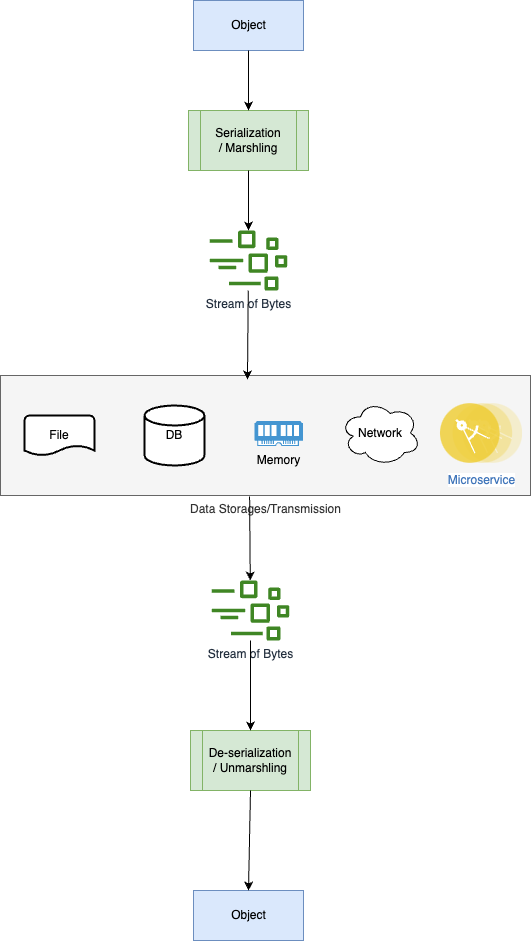

# Serialization
- [Data serialization](https://devopedia.org/data-serialization) is the process of converting structured data to a format that allows sharing or storage of the data in a form that allows recovery of its original structure. 
- Data de-serialization is the exact opposite.

# Serialization Formats

| Format                                            | Type               | Remarks       |
|---------------------------------------------------|--------------------|---------------|
| [JSON](Formats/JSON.md)                           | Text-based formats |               |
| [YAML](Formats/YAML.md)                           | Text-based formats |               |
| [Protocol Buffers](Formats/ProtoBufWireFormat.md) | Binary formats     |               |
| [Avro Format](Formats/AvroFormat.md)              | Binary formats     |               |
| Thrift Format                                     | Binary formats     |               |
| XML                                               | Text-based formats | Legacy format |

# Programming language support

| Language   | Description                                                                                                                                                                                   |
|------------|-----------------------------------------------------------------------------------------------------------------------------------------------------------------------------------------------|
| Go         | Go natively supports `unmarshalling/marshalling` of JSON and XML data.  - There are also third-party modules that support YAML and Protocol Buffers.                                      |
| Java       | Java provides automatic serialization which requires that the object be marked by implementing the `java.io.Serializable` interface.                                                          |
| JavaScript | JavaScript has included the built-in JSON object and its methods JSON.parse() and JSON.stringify().                                                                                           |
| Python     | The core general serialization mechanism is the pickle standard library module, alluding to the database systems term pickling to describe data serialization (unpickling for deserializing). |